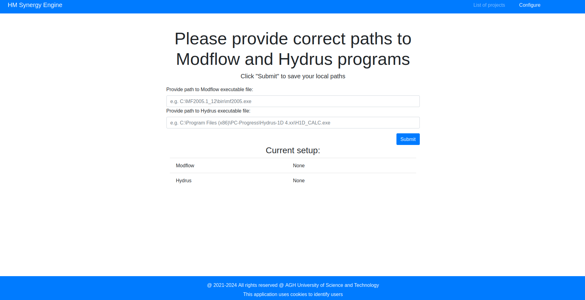

# HMSE Monorepo
This repository contains all the code and components related to Hydrus-Modflow-Synergy-Engine (HMSE).
The software can be used to automate external coupling of programs Hydrus-1D and Modflow 2005. The application
has three deployments:
* desktop - dedicated for running locally on machine  with Windows OS
* docker - dedicated for running in containerized environment (OS independent)
* K8S - cloud microservice deployment (SaaS model) based on Kubernetes framework, easily scalable

More about software can be found in the publication: https://www.softxjournal.com/article/S2352-7110(24)00051-7/fulltext

## Components
- [HMSE core code](https://github.com/WaterlinePL/hmse-monorepo/tree/hmse-core) - web application along with CLI script
to run simulations (all the deployments share the same codebase)
- [HMSE DAGs](https://github.com/WaterlinePL/hmse-monorepo/tree/hmse-dags) - Airflow DAGs used for simulation 
in K8S deployment
- [HMSE helm chart](https://github.com/WaterlinePL/hmse-monorepo/tree/hmse-helm-chart) - umbrella Helm chart used to 
set up K8S deployment microservices and other Kubernetes components
- [HMSE utils](https://github.com/WaterlinePL/hmse-monorepo/tree/hmse-utils) - Python package with HMSE utilities 
used both in HMSE core and K8S jobs to execute common logic (e.g. data transfer between models or setting up files
before simulation)
- [Hydrus 1D Linux](https://github.com/WaterlinePL/hmse-monorepo/tree/hydrus-1d-linux) - source code for Linux version
of Hydrus-1D software, slightly adapted (thanks to Jiri Simunek and Adam Szymkiewicz for providing the code)
- [HMSE K8S jobs](https://github.com/WaterlinePL/hmse-monorepo/tree/k8s-jobs) - a set of docker images that are used to
run simulations as K8S pods by Airflow in K8S deployment
- [phydrus](https://github.com/WaterlinePL/hmse-monorepo/tree/phydrus) - a forked version of 
[phydrus](https://github.com/phydrus/phydrus) Python package used as part of HMSE, slightly adapted


## Manuals
Installation and development manuals are listed below:
* [HMSE](https://github.com/WaterlinePL/hmse-monorepo?tab=readme-ov-file#hmse-manual)
* [Hydrus 1D Linux](https://github.com/WaterlinePL/hmse-monorepo?tab=readme-ov-file#hydrus-1d-linux-manual)

## HMSE manual

### Installation

#### Desktop
There are 2 ways you can run desktop version of HMSE web application:
* Running using Python interpreter - available in [Runnning python scripts](https://github.com/WaterlinePL/hmse-monorepo?tab=readme-ov-file#running-python-scripts) section below
* Running prebuilt executables from a release
  * Prebuilt executables:
    1. Find latest version of desktop version in the Github [releases](https://github.com/WaterlinePL/hmse-monorepo/releases).
    2. Download the .zip archive `hmse-desktop-<version>.zip` (available [here](https://github.com/WaterlinePL/hmse-monorepo/releases/download/desktop-1.0.0/hmse-desktop-1.0.0.zip)) # TODO
    3. Unpack .zip archive
    4. Launch `hmse.exe` (in archive: `hmse/hmse.exe`)
    5. Complete application configuration described below
  * Manual build:
aasa # TODO 
```commandline
pip install -r requirements.txt
pyinstaller.exe --onedir -n hmse --paths ".\hmse-core" \
                --add-data ".\hmse-core\server\templates;server\templates" \
                --add-data ".\hmse-core\server\static;server\static"  \
                hmse-core\main.py
```


Desktop application configuration:
In order to run a simulation in the application, the user must download following two programs:
* [MODFLOW-2005](https://www.usgs.gov/software/modflow-2005-usgs-three-dimensional-finite-difference-ground-water-model)
* [HYDRUS-1D](https://www.pc-progress.com/en/Default.aspx?H1d-downloads) (requires registration)

When accessing the simulation, the application will redirect to the configuration page and will prompt for the paths to 
executables for the programs mentioned above. Currently, there is no other way of providing the path to executables due 
to local storage access policy of web browsers (web browser cannot access the local file system).



#### Docker
Image can be easily run using docker-in-docker and `docker-compose.yml` in the main directory. 
The manifest launches the latest version, but it can be customized by selecting other tag 
from [watermodelling/hmse-docker](https://hub.docker.com/repository/docker/watermodelling/hmse-docker) Dockerhub Repository. 

To launch application, do as follows:
  1. Download [docker-compose.yml](https://github.com/WaterlinePL/hmse-monorepo/blob/main/docker-compose.yml) manifest from repository (or copy it)
  2. Inside the directory with the `docker-compose.yml` run:
  ```bash
  docker compose up
  ```

#### K8S

HMSE software makes use of Airflow scheduler, NFS volume provisioner and a webserver. As such, the easiest way to deploy
such an architecture is to use a Helm chart:
1. Deploy NFS provisioner (such as [nfs-ganesha-server-and-external-provisioner](https://github.com/kubernetes-sigs/nfs-ganesha-server-and-external-provisioner/tree/master/charts/nfs-server-provisioner)).
It is important to configure NFS provisioning with ReadWriteMany access mode and set it as default StorageClass. For
the referenced provisioner desired setup can be achieved as follows:

---
Make `provisioner-values.yaml` with following content:
```yaml
persistence:
  accessMode: ReadWriteMany
  size: 10Gi    # suggested not going below 2Gi
storageClass:
  defaultClass: true
```

Then add repo and deploy the provisioner in the cluster:

```bash
helm repo add nfs-ganesha-server-and-external-provisioner https://kubernetes-sigs.github.io/nfs-ganesha-server-and-external-provisioner/
helm install nfs-provisioner nfs-ganesha-server-and-external-provisioner/nfs-server-provisioner --values provisioner-values.yaml
```

2. Create and configure values in `hmse-values.yaml` file by providing requires values from [values file](https://github.com/WaterlinePL/hmse-monorepo/blob/main/hmse-helm-chart/hmse/values.yml):
**Required:**

* airflow.airflow.variables:
    * update preprocessing value `s3-secret-name` (if created S3 secret from previous point under different name)
    * hmseWebserver.s3:
        * region - S3 region
        * bucket - S3 bucket for storing project data
        * interface - S3 interface type (S3/MinIO)
        * secret - S3 secret details
          * accessKey - S3 access key
          * secretKey - S3 secret key
          * endpoint - S3 interface endpoint (e.g. used by MinIO)

**Optional:**

* airflow.airflow.users:
    * username (for security reasons)
    * password (for security reasons)
* hmseWebserver.ingress.prefix - prefix used for ingress if needed

For more configuration options please reference values.yaml file.

3. Deploy umbrella HMSE chart 

Add repo (one-time operation):

```bash
helm repo add hmse-repo https://waterlinepl.github.io/hmse-monorepo/hmse-helm-chart/charts/
```

Then deploy the provisioner in the cluster:

```bash
helm install hmse hmse-repo/hmse -n <desired namespace> --values <your Values.yaml file>
```

**Important!**
Note that this setup is simplified, as Airflow should be configured with secrets for its components and may not be safe 
to use in a production environment. 

### Running python scripts

#### HMSE webserver
Available deployments:
* desktop
* docker
* K8S

In hmse-core directory:
```bash
python main.py [--deployment <deployment>, <extra options>...]
```

Available options:

| Name                 | Available values            | Required | Default | Example | Description                                                              |
|----------------------|-----------------------------|----------|---------|---------|--------------------------------------------------------------------------|
| `-d`, `--deployment` | [desktop, docker, k8s]      | Yes      | desktop | desktop | Application version that should be launched (for particular deployment)  |
| `-p`, `--port`       | int                         | No       | 8080    | 8080    | Port on which HTTP server will be launched                               |
| `-l`, `--log`        | [debug, info, warn, error]  | No       | info    | info    | Application logging level                                                |


#### HMSE runner
Available deployments:
* desktop
* docker

In hmse-core directory:
```bash
python hmse_runner.py --project-id <project_id> --workspace <workspace_path> [--deployment <deployment>, <extra options>...]
```

Available options:

| Name                   | Available values           | Required  | Default | Example                          | Description                                                                                                               |
|------------------------|----------------------------|-----------|---------|----------------------------------|---------------------------------------------------------------------------------------------------------------------------|
| `-p`, `--project-id`   | str                        | Yes       | -       | test-project                     | ID (name) of project to run                                                                                               |
| `-w`, `--workspace`    | OS path                    | Yes       | -       | ./workspace                      | Local path to workspace                                                                                                   |
| `-d`, `--deployment`   | [desktop, docker, k8s]     | Yes       | desktop | desktop                          | Application version that should be launched (for particular deployment)                                                   |
| `--with-config`        | OS path                    | No        | -       | "C:\modflow\bin\mf2005.exe"      | Path to Hydrus executable that should be set for HMSE (desktop only, precedence over config.json)                         |
| `--with-hydrus`        | OS path                    | No        | -       | "C:\Hydrus-1D 4.xx\H1D_CALC.exe" | Path to Modflow executable that should be set for HMSE (desktop only, precedence over config.json)                        |
| `--with-modflow`       | OS path                    | No        | -       | .\config.json                    | Path to HMSE config file (config.json), which contains paths to hydrus and modflow executables (desktop only)             |
| `-l`, `--log`          | [debug, info, warn, error] | No        | info    | info                             | Application logging level                                                                                                 |


### Development

In general, HMSE shares whole codebase across all the deployments. However, some components are exclusive to docker/K8S
deployments. To run

#### Desktop

Building executables locally

Required software for building:
* Python >= 3.10
* pip
* pyinstaller


To generate an executable from the source code, follow these steps in the root directory of the repository (on a Windows OS):
```commandline
pip install -r requirements.txt
pyinstaller.exe --onedir -n hmse --paths ".\server" \
                --add-data ".\server\templates;templates" \
                --add-data ".\server\static;static"  \
                .\server\main.py
```

After creating a build with PyInstaller, the executable is located in the `dist` folder (`hmse.exe`).


#### Docker
This deployment additionally depends on 2 Docker images:
* Modflow simulation (Dockerhub image): [mjstealey/docker-modflow](https://hub.docker.com/r/mjstealey/docker-modflow)
* Hydrus simulation (our image, used also by Docker deployment): [watermodelling/hydrus-1d-docker](https://hub.docker.com/repository/docker/watermodelling/hydrus-1d-docker/general)

```bash
docker build -t watermodelling/hmse-docker:<tag> .
```

#### K8S

This deployment additionally depends on following components:
* [Airflow DAGs](https://github.com/WaterlinePL/hmse-monorepo/tree/hmse-dags) - simulation task scheduling, uses K8S jobs to execute operations on the project
by creating pods in K8S cluster: [watermodelling/airflow](https://hub.docker.com/repository/docker/watermodelling/airflow/general)
* [Helm Chart](https://github.com/WaterlinePL/hmse-monorepo/tree/hmse-helm-chart) - umbrella chart for deployment, which after value setup can create all the K8S deployments
in the cluster
* [K8S jobs](https://github.com/WaterlinePL/hmse-monorepo/tree/k8s-jobs) - docker images that are used to perform following parts of the simulation:
  * setting up simulation environment on K8S volume inside the pod delivered using PVC: [watermodelling/minio-manipulation-job](https://hub.docker.com/repository/docker/watermodelling/minio-manipulation-job/general)
  * perform Hydrus/Modflow simulations
    * Modflow simulation (Dockerhub image): [mjstealey/docker-modflow](https://hub.docker.com/r/mjstealey/docker-modflow)
    * Hydrus simulation (our image, used also by Docker deployment): [watermodelling/hydrus-1d-docker](https://hub.docker.com/repository/docker/watermodelling/hydrus-1d-docker/general)
  * transfer data between models to provide proper external coupling and manipulate simulation files: [watermodelling/simulation-files-manipulation-job](https://hub.docker.com/repository/docker/watermodelling/simulation-files-manipulation-job/general)

```
docker build -t watermodelling/hmse-k8s:<tag> .
```

1. Make necessary changes in the components for K8S deployment
2. Build needed Docker images with `-pre` suffix in all the tags
3. Test changes
4. Make sure all the pipelines pass
5. Check if Helm chart can be properly installed - edit chart in `hmse-helm-chart` directory and update chart version. 
Then execute commands in the directory:
```
helm package hmse -d charts/
helm repo index charts/
```


### Releasing a new version

#### New version checklist
When releasing a new version, please update version numbers in following places:
* [Helm chart HMSE image version](https://github.com/WaterlinePL/hmse-monorepo/blob/main/hmse-helm-chart/hmse/charts/hmseWebserver/values.yaml)
* [Helm chart HMSE webserver chart version](https://github.com/WaterlinePL/hmse-monorepo/blob/main/hmse-helm-chart/hmse/charts/hmseWebserver/Chart.yaml) - would be best if it matches HMSE core version
* [Helm chart HMSE umbrella chart version along with HMSE webserver version](https://github.com/WaterlinePL/hmse-monorepo/blob/main/hmse-helm-chart/hmse/Chart.yaml) - would be best if it matches HMSE core version (both HMSE webserver version and umbrella chart version)
* [Helm chart Airflow variables setup (hmse_version), Airflow image version and HMSE webserver version in default umbrall chart values](https://github.com/WaterlinePL/hmse-monorepo/blob/main/hmse-helm-chart/hmse/values.yaml)

Those changes are related to Helm chart artifact for K8S deployment and unfortunately cannot be easily automated.

#### Making release
Before making a release: **Please make sure that [New version checklist](https://github.com/WaterlinePL/hmse-monorepo?tab=readme-ov-file#new-version-checklist) has been completed!**

In order to release a new version of HMSE simply create and push tag using git:

1. `git tag vX.X.X` (e.g. `git tag v1.2.0`)
2. `git push origin vX.X.X` (e.g. `git push origin v1.2.0`)

This triggers an automatic pipeline to make all the necessary artifacts on Github and Dockerhub (docker images, 
and helm chart). It also creates latest release on Github. 

The new version of Helm chart for K8S deployment should be added to `helm-repo` branch, inside `hmse-helm-chart/charts`.
This branch serves also as Helm repo exposed via Github pages.

## Hydrus 1D Linux manual

The code is based on [another version of Hydrus-1D source code adapted to linux-based OS](https://github.com/AgriHarmony/HYDRUS-1-D-gfortran).
It couldn't be possible with code modifications delivered by Jiri Simunek and Adam Szymkiewicz.

### Installation
Currently, the only way to install this version of phydrus is to compile it from sources using `gfortran` compiler.

1. Navigate to `hydrus-1d-linux/src`
2. Run `make` command

This compiles code into objects and create `hydrus` executable file.

### Development
Making any changes in the `hydrus-1d-linux` directory will trigger a pipeline that check if application can be build
using Make.
